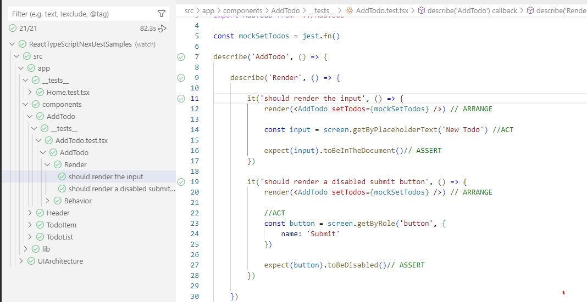

# Testing a Next.js App with Jest, React Testing Library and TypeScript

## Todo List

In src/app there is a simple To Do List React App that demonstrates an elegant setup of a simple app with an almost full coverage of corresponding tests.
The tests make user of the React Testing Library to render and find elements within a test run.

Use VS Code extension vscode-jest Jest from Orta.

![VS Code Test extension] (docs/VSCodeTestUI1.png)

install
run app
run tests

UI Architecture - Scalable TDD - lesson 2
Logic Room UI - Architecture Approach

This project contains 2 distinct projects that demonstrate two different approaches to automated UI testing:
### before
In the before folder there is a very simple  React App that consists of the typical layers you'd expect in a real SPA.
UI components, and some type HTTP request client for calling data endpoints. 
The data retrieval is handled at the source of the component tree and passed into child compomenets as props - known as 'prop drilling'.

When testing this type of code the UI rendering and search libraries are needed to be able to directly test the output UI elements themselves:

### after
In the after folder the same application has been refactored to isolate the business logic and invert the dependency of the components and the testing.
The conecpt of centralizing busine logic at the core of the depency chain isn't dissimar from BE designs such as DDD or Clean Arhcitecture. 

In this simple example the dependency on the UI and UI testing libraries is removed and the testing becomes much less complex and verbose.
Which in turn makes it easier and thus more likely that developers will write tests.

install
run app
run tests

### References
- 🔗 [My Courses](https://courses.davegray.codes/)
- 🔗 [Next.js Official Site](https://nextjs.org/)
- 🔗 [TypeScript Official Site](https://www.typescriptlang.org/)
- 🔗 [Jest Official Site](https://jestjs.io/)
- 🔗 [React Testing Library Official Site](https://testing-library.com/docs/react-testing-library/intro)
